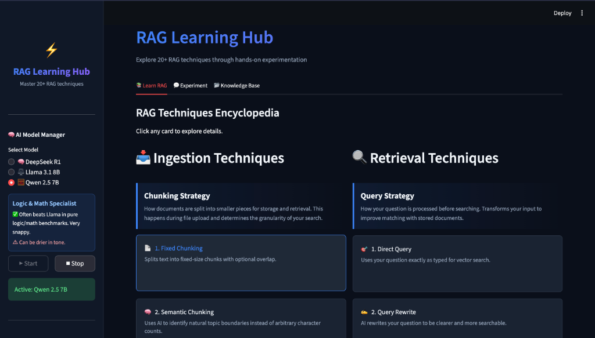
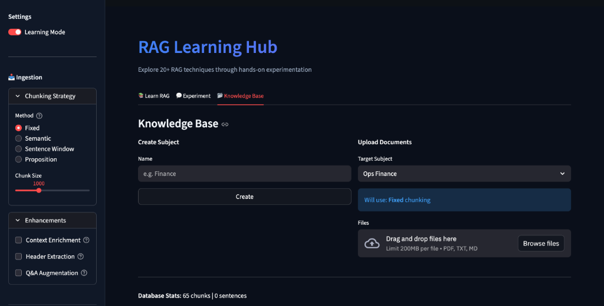
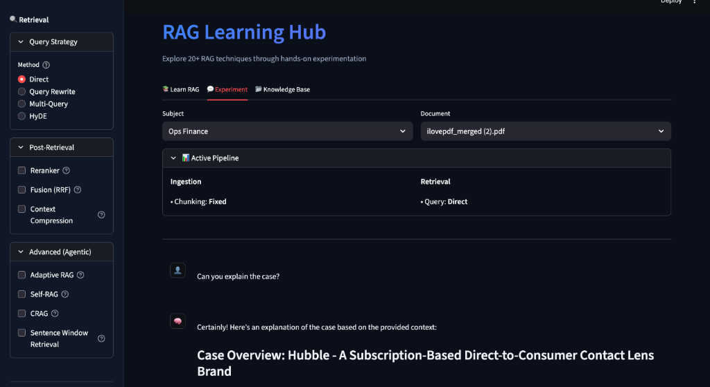

# Learning RAG 🧠

**Learning RAG** is a hands-on platform designed to explore, experiment with, and master advanced **Retrieval-Augmented Generation (RAG)** techniques.

This project goes beyond simple vector search, implementing a comprehensive suite of **15+ advanced RAG patterns** from scratch using Python, Ollama, and ChromaDB. It serves as both a learning tool and a reference implementation for building production-grade RAG systems.

---

## 🚀 Features at a Glance

*   **Local-First & Privacy Focused**: Runs entirely on your machine using **Ollama** (Llama 3, DeepSeek R1, etc.).
*   **Interactive Playground**: Built with **Streamlit** for real-time experimentation.
*   **Modular Architecture**: Toggle different ingestion and retrieval strategies on the fly.
*   **Deep Reasoning**: Integrated support for reasoning models like `deepseek-r1`.

## 📸 Platform Screenshots

| Dashboard | Ingestion Settings |
|:---:|:---:|
|  |  |

| Experimentation & Retrieval |
|:---:|
|  |


---

## 🛠️ Implemented RAG Techniques

This repository implements the following techniques (located in `rag_engine.py`), categorized by their stage in the RAG pipeline:

### 1. Advanced Ingestion (Pre-Retrieval)
*These techniques optimize how data is processed, chunked, and stored.*

*   **Semantic Chunking** (Technique 2): instead of arbitrary fixed sizes, splits text based on semantic meaning using embeddings/LLMs to keep related concepts together.
*   **Context Enrichment** (Technique 4): "Injects" a summary of the surrounding document section into each chunk, ensuring chunks carry their context even when retrieved in isolation.
*   **Contextual Chunk Headers** (Technique 5): Automatically detects and prepends document hierarchy (e.g., `> Section 1 > Subsection A`) to chunks, helping the model understand structure.
*   **Document Augmentation** (Technique 6): Generates "potential questions" that a chunk answers and indexes them alongside the text. This increases the likelihood of a match for user queries.
*   **Sentence Window Retrieval** (Technique 9): Indexes single sentences for high-precision search, but retrieves the surrounding "window" (e.g., 5 sentences before/after) to provide full context to the LLM.
*   **Proposition Chunking** (Technique 14): Breaks complex sentences into atomic, standalone facts (propositions) for extremely precise retrieval of specific details.

### 2. Advanced Retrieval (Search Time)
*These techniques improve the quality and relevance of search results.*

*   **Query Transformation** (Technique 7):
    *   **Query Rewrite**: Reformulates user queries to be more specific and search-friendly.
    *   **Multi-Query**: Generates multiple variations of a question to search from different angles.
    *   **HyDE (Hypothetical Document Embeddings)** (Technique 19): Generates a hypothetical "perfect answer" and searches for chunks similar to *that*, rather than the raw question.
*   **Reranking** (Technique 8): Retrieves a larger set of candidates (e.g., Top 50) and uses a high-precision **Cross-Encoder** to re-score and re-order them, significantly improving top-k accuracy.
*   **Fusion RAG** (Technique 16): Uses **Reciprocal Rank Fusion (RRF)** to combine results from multiple retrieval strategies into a single, robust ranking.
*   **Adaptive RAG** (Technique 12): Classifies queries (Simple vs. Complex) to dynamically route them—simple questions go straight to LLM, complex ones trigger deep RAG workflows.

### 3. Post-Retrieval & Generation
*These techniques refine the context and ensure answer quality.*

*   **Contextual Compression** (Technique 10): Uses an LLM to "compress" retrieved chunks, stripping away irrelevant information before passing them to the Context Window.
*   **Self-RAG** (Technique 13): The model evaluates the *relevance* of retrieved documents relative to the query before generating an answer.
*   **CRAG (Corrective RAG)** (Technique 20): Evaluates the generated answer's quality. If "Ambiguous" or "Wrong", it can suggest fallback actions (like web search - *simulated*).
*   **Feedback Loops** (Technique 11): Records user ratings and comments to create a dataset for future fine-tuning or evaluation.

---

## ⚙️ Setup & Usage

### Prerequisites
1.  **Python 3.10+**
2.  **Ollama**: Install from [ollama.com](https://ollama.com/) and pull the required models:
    ```bash
    ollama pull llama3
    ollama pull deepseek-r1:8b
    ollama pull nomic-embed-text
    ```

### Installation

1.  **Clone the repository**:
    ```bash
    git clone https://github.com/Rajasbhagat/RAG-Techniques.git
    cd Learning_RAG
    ```

2.  **Create a virtual environment**:
    ```bash
    python -m venv venv
    source venv/bin/activate  # On Windows: venv\Scripts\activate
    ```

3.  **Install dependencies**:
    ```bash
    pip install -r requirements.txt
    ```

### Running the App

```bash
streamlit run app.py
```

Open your browser to `http://localhost:8501`.

---

## 📂 Project Structure

*   `app.py`: Main Streamlit application entry point.
*   `rag_engine.py`: **Core Logic**. Contains the `RAGEngine` class and implementation of all 15+ techniques.
*   `rag_config.py`: Configuration settings for the RAG pipeline.
*   `styles.py`: UI styling and CSS.
*   `chroma_db/`: Local vector database storage.
*   `data/`: Storage for uploaded PDF/Text documents.

---

## 🤝 Contribution

Feel free to fork this repository and implement more RAG techniques!

Current Roadmap:
- [ ] GraphRAG Implementation
- [ ] Agentic RAG workflows
- [ ] Evaluation Framework integraton (Ragas/DeepEval)
